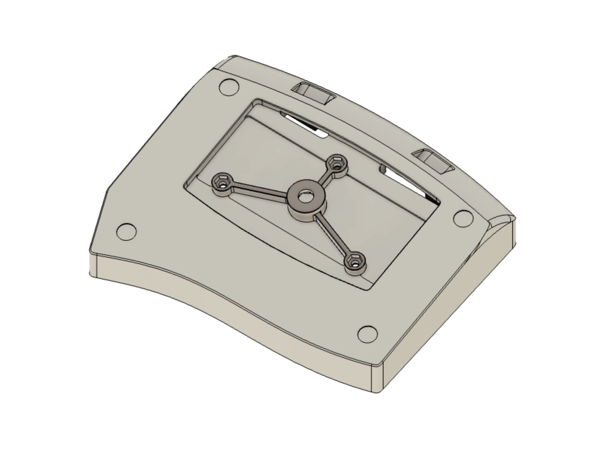
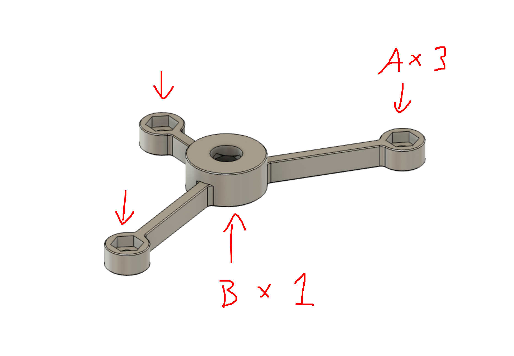

# Altair(-X) Tripod Mount
A 3D printable tripod mount for the [Altair(-X) keyboard](https://ai03.com/projects/altair/).

Note that **this is completely untested - proceed at your own risk**; depending on how long the threads of the tripod are, you may need to extend the 3D print body or add some washers to prevent it from grinding into the case.  

The files are in .step format - feel free to modify as necessary in your CAD program of choice.  
See the [license file](./LICENSE.txt) before use.  

# Assembly Instructions

1. Print the variant of your choice on a decently calibrated 3D printer in a reasonably durable material.
2. Remove the stock weight from the case.  
3. Insert a [1/4-20 nut](https://www.mcmaster.com/90499A029/) into the center hex hole (B).
5. Align the mount to the weight cavity so that the screw holes align.
6. Insert a [M3 nut](https://www.mcmaster.com/90685A037/) into one of the smaller hex holes (A), then secure through the weight hole using a [M3 countersunk screw of 6-8mm length](https://www.mcmaster.com/92125A128/).
